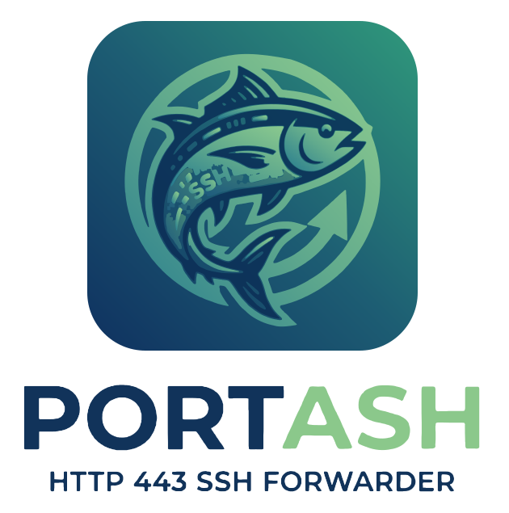

<p align="center"></p>

# portash

*Porta* is Italian for door: portash is a door to your shells.

SSH to your VMs from anywhere, with port 22 closed to the internet. It works
on hotel Wi-Fi that blocks everything but HTTPS, survives laptop sleep and
network changes, and adds the controls OpenSSH lacks: a daily TOTP unlock,
TOTP sudo, recorded and sandboxed shells, and command allowlists. One small Go
binary, no third-party dependencies, MIT licensed.

- [How it works](#how-it-works)
- [Installation](#installation): the VM, then each laptop
- [Usage](#usage): a normal day, file copies, VS Code, Ansible
- [Managing access](#managing-access): people, roles, sudo, restricted keys, logs
- [Optional: with a Vabbit VPN](#optional-with-a-vabbit-vpn)
- [Reference](#reference), [Develop](#develop), [License](#license)

## How it works

You type a normal `ssh vm1.example.com`. Your `~/.ssh/config`, written by
`portash ssh-config`, tells ssh to go through portash:

```
Host vm1.example.com
    HostName 127.0.0.1
    HostKeyAlias vm1.example.com
    ProxyCommand portash dial --gateway vm1.example.com %h %p
```

What happens then:

```
 laptop                                     VM
+-----+   pipe   +--------------+  HTTPS   +-----------------+  local  +------+
| ssh | <------> | portash dial | <======> | portash gateway | <-----> | sshd |
+-----+          +--------------+ TCP 443  +-----------------+ :22 on  +------+
                                  TLS 1.3                   127.0.0.1
```

* Each VM runs `portash gateway` on port 443. It only ever forwards to that
  VM's own sshd, which listens on localhost. Port 22 stays closed.
* On the laptop, `portash dial` is OpenSSH's `ProxyCommand`, so `ssh`, `scp`,
  `rsync`, Ansible and VS Code Remote work unchanged. SSH stays encrypted end
  to end inside the TLS connection.
* To get in, a laptop needs its token (bound to that laptop's device key, so a
  copied token is useless), a daily TOTP unlock, and then a normal SSH key.
* After login, `portash shell` and `portash restrict` decide what the session
  may do; `portash authd` checks TOTP codes and writes the audit log and
  recordings as root.

There is no shared server in the middle: one hacked VM doesn't open the others.

## Installation

You install portash once on each VM, and once on each laptop.

### Get the binary

Until there are signed releases, build it (Go 1.22 or newer):

```sh
git clone https://github.com/thomaskhub/portash && cd portash
make build                                                           # dist/portash for this machine
GOOS=linux   GOARCH=amd64 go build -o dist/portash-linux     ./cmd/portash   # for the VMs
GOOS=windows GOARCH=amd64 go build -o dist/portash.exe       ./cmd/portash   # for a Windows laptop
```

CI also builds Linux, macOS and Windows binaries on every push (the `portash`
artifact on the Actions page).

### On each VM (Linux)

Do this as root on every VM, with a second way in (the cloud console) until
you have tested it.

**1. Install portash and keep sshd on localhost.**

```sh
install -m 755 portash-linux /usr/local/bin/portash
echo "ListenAddress 127.0.0.1" > /etc/ssh/sshd_config.d/portash.conf
echo "PasswordAuthentication no" >> /etc/ssh/sshd_config.d/portash.conf
systemctl restart ssh
```

**2. Create the gateway's TLS key and note its pin.** Laptops pin this key, so
no certificate authority is needed:

```sh
portash fingerprint --dir /var/lib/portash      # prints sha256:...; send it to your users
```

**3. Sign the VM's host key** with an SSH CA, so laptops never have to trust a
host key on first sight (a compromised network could impersonate the VM). Use
the name people will type, e.g. `vm1.example.com`:

```sh
# once, on an offline machine: ssh-keygen -t ed25519 -f host_ca
ssh-keygen -s host_ca -I vm1 -h -n vm1.example.com -V +52w /etc/ssh/ssh_host_ed25519_key.pub
echo "HostCertificate /etc/ssh/ssh_host_ed25519_key-cert.pub" >> /etc/ssh/sshd_config.d/portash.conf
systemctl restart ssh
```

**4. Start authd** (TOTP checks, audit log, session recordings):

```sh
cp packaging/portash-authd.service /etc/systemd/system/
systemctl enable --now portash-authd
```

**5. Start the gateway**, then add people (see [Add a person](#add-a-person)).
Until the first token exists, it lets nobody in.

```sh
cp packaging/portash-gateway.service /etc/systemd/system/
systemctl enable --now portash-gateway
```

**6. Open TCP 443 and close 22** in the cloud firewall.

### On each laptop (Linux or Windows; macOS builds but is untested)

Put `portash` on your `PATH`, then:

```sh
portash device                  # once; prints pshd_..., send it to your admin
```

Your admin gives you, per VM, its pin and a `psh_` token, plus a TOTP QR code
or `otpauth://` link once. Scan that into any authenticator app. Then add each
VM by the name in its host certificate:

```sh
portash login vm1.example.com --pin sha256:...      # asks for the psh_ token
portash login vm2.example.com --pin sha256:...
portash ssh-config >> ~/.ssh/config                  # one Host block per VM
echo "@cert-authority *.example.com $(cat host_ca.pub)" >> ~/.ssh/known_hosts
```

Add your login and SSH key under each `Host` block as with any ssh host:

```
    User ubuntu
    IdentityFile ~/.ssh/id_ed25519_work
    IdentitiesOnly yes
```

For a VM added later, run
`portash ssh-config vm3.example.com >> ~/.ssh/config`.

## Usage

### A normal day

```sh
portash unlock          # once in the morning: one TOTP code unlocks every VM for 12 hours
ssh vm1.example.com     # then just use ssh
portash status          # which VMs are set up and how long they stay unlocked
```

Without a valid unlock, ssh stops with `unlock required: run portash unlock`.
When the 12 hours run out, open sessions close too.

If your laptop sleeps or you switch networks, the session freezes and then
carries on where it was, for up to 10 minutes; no tmux needed. A hotel captive
portal is fine as long as you log in to it within that time.

### Copying files, VS Code, port forwards

Everything that uses your ssh config works as usual:

```sh
scp app.tar.gz vm1.example.com:/tmp/
rsync -av ./site/ vm1.example.com:/srv/site/
ssh -L 5432:localhost:5432 vm1.example.com      # if your role allows forwarding
```

VS Code Remote SSH picks the hosts up from `~/.ssh/config`.

### Ansible

Ansible also uses your ssh config, so after `portash unlock` it reaches every VM
with no prompts. Reuse one connection per host:

```ini
# ansible.cfg
[ssh_connection]
ssh_args = -o ControlMaster=auto -o ControlPersist=60s
pipelining = True
```

TOTP sudo would ask for a code on every `become`, so give Ansible its own user
with passwordless sudo (role Admin, see below). The daily unlock protects it.

### sudo on a VM

If your admin turned on TOTP sudo, sudo asks for a code from your authenticator
instead of a password, every time:

```
$ sudo systemctl restart nginx
[sudo] password for alice:      <- type the 6-digit code
```

### When something goes wrong

* `portash dial -v` (change `ProxyCommand` to add `-v`, or run
  `ssh -o ProxyCommand="portash dial -v --gateway vm1.example.com %h %p" vm1.example.com`)
  prints how it connected and when it reconnects.
* `rejected (bad or expired token, wrong device ...)`: the token was revoked or
  expired, or this isn't the laptop it was made for. Ask for a new one.
* `Host key verification failed`: the VM's certificate doesn't name the host you
  typed, or the `@cert-authority` line is missing.

## Managing access

All of this runs as root on the VM.

### Add a person

```sh
# their device key from `portash device`; prints a psh_ token, shown once
portash token add alice-laptop --device pshd_... --ttl 2160h --dir /var/lib/portash

# daily unlock: enroll on the first VM, import the same secret on the others
portash totp enroll alice-laptop --unlock           # prints otpauth://..., give it to Alice once
echo 'otpauth://...' | portash totp import alice-laptop --unlock     # on every other VM

# their SSH key, with a role (below)
echo 'command="portash shell" ssh-ed25519 AAAA... alice' >> ~alice/.ssh/authorized_keys
```

Send Alice the token, the gateway pin and the TOTP link over a channel you
trust. Tokens expire after `--ttl` (default 90 days).

### Remove a person or a laptop

```sh
portash token rm alice-laptop --dir /var/lib/portash
```

New connections are refused at once and open sessions are cut within 5
seconds. Also remove their key from `authorized_keys`.

### Roles

Pick one per SSH key in `authorized_keys` (or with `Match User` + `ForceCommand`
in sshd_config):

| Role | authorized_keys prefix | What they get |
| --- | --- | --- |
| Admin | `command="portash shell"` | Full shell, every session recorded, every command logged, sudo per sudoers |
| Operator | `command="portash shell --sandbox --write ~/work"` | Full shell, recorded, but can only create, change or delete files in `/tmp`, `/var/tmp` and `~/work`; no sudo |
| Restricted | `restrict,command="portash restrict --policy FILE"` | Only allowlisted commands; some can require a TOTP code |

**Sandbox.** `--sandbox` uses Landlock (Linux 5.13+), so the kernel itself
refuses writes outside the allowed directories, however the command is written
(`r''m`, base64, a script, vim, python), and for everything the session starts.
Reading is not restricted, and sudo is disabled inside it.

### TOTP sudo

Enroll the user for sudo codes (separate from the daily unlock), and scan the
printed link:

```sh
portash totp enroll alice
```

Put this first in `/etc/pam.d/sudo` (keep `@include common-auth` after it for
password and code; remove it for code only), and set
`Defaults timestamp_timeout=0` in sudoers to ask on every sudo:

```
auth required pam_exec.so expose_authtok quiet /usr/local/bin/portash pam-totp
```

Codes can't be reused, and 5 wrong codes lock the user for 15 minutes.

### Restricted keys (CI bots, contractors)

Give a key an allowlist instead of a shell. `/etc/portash/policy/deploy`
(root-owned, not group/other writable):

```
# One allowed command per line. Matching is per argument:
#   *    matches one argument (glob; doesn't cross "/")
#   ...  at the end matches any number of further arguments
# Wildcards never match an argument starting with "-": write flags out.
# Programs that can start a shell (bash, vim, less, python, sudo, find, ...)
# are refused, and docker/git/tar/rsync/... only with fixed arguments.
# "!unsafe <rule>" overrides that for a program you have checked.
# "!totp <rule>" asks for a TOTP code first (typed, or piped: echo 123456 | ssh vm cmd).
# "!deny <rule>" refuses matches even if another rule allows them; in deny
# rules wildcards also match flags and the program may be a pattern.
uptime
systemctl status ...
!totp systemctl restart nginx
journalctl -u nginx -n *
!deny * --force
```

```
restrict,command="/usr/local/bin/portash restrict --policy /etc/portash/policy/deploy --name ci-bot" ssh-ed25519 AAAA... ci-bot
```

`restrict` also turns off port, agent and X11 forwarding and the PTY; without
it, portash refuses to run. Commands run directly, never through a shell, with
a fixed PATH and a scrubbed environment. Test a rule with
`portash restrict --policy FILE --check 'systemctl restart nginx'`. The linter
catches the common shell escapes, but no list is complete: check any program
you allow for ways to start other programs.

### Logs and recordings

* `/var/log/portash/audit.log`: every session and command, written by authd.
* `/var/log/portash/sessions/<user>/*.cast`: interactive sessions, play with
  `asciinema play FILE`.
* `journalctl -u portash-gateway`: connections, unlocks, denials.
* `journalctl -t portash-restrict`: every allowed and denied restricted command.

If authd is down, sessions are refused (`--fail-open` to allow them anyway).
Admins without `--sandbox` can write around the recording; the audit log still
sees every command.

### Rotate the gateway key

Give laptops both pins (`portash login NAME --pin sha256:old,sha256:new`),
switch the gateway's key, then drop the old pin.

## Optional: with a Vabbit VPN

If your VMs are on a Vabbit VPN, one gateway can serve all of them, and laptops
go direct over WireGuard whenever UDP works:

```sh
# on the gateway host (on the VPN, port 443 open):
portash gateway --network 100.92.0.0/16 --listen :443 --dir /var/lib/portash
# on each VM: sshd listens on its VPN address instead of 127.0.0.1
# on the laptop:
portash login vpn --gateway gw.example.com --pin sha256:... --network 100.92.0.0/16
portash ssh-config vpn >> ~/.ssh/config     # then add a Host/HostName block per VM
```

The direct path is only tried when the OS routes the target through the VPN,
so a look-alike address on hotel Wi-Fi is never dialled. If Vabbit's own 443
fallback already holds the port, use `--listen :8443` (see docs/DESIGN.md).

## Reference

`portash help` lists every command and flag. Gateway defaults: 512 connections,
16 streams per token, 10-minute idle timeout, 24-hour maximum session,
10-minute resume window, 12-hour unlock (`--ticket-ttl`), and an IP is ignored
for 10 minutes after 10 failed attempts. See [docs/DESIGN.md](docs/DESIGN.md)
for the design and security model.

## Develop

```sh
make test        # unit tests: auth, device binding, expiry, pinning, limits, revocation, policy, resume, unlock
make e2e         # real sshd/ssh/scp: host CA, stolen token, restricted keys, network drop, unlock (root)
sudo ./scripts/e2e-server.sh   # TOTP sudo, recording, sandbox, TOTP rules; creates users, edits PAM: throwaway VM only
make sbom        # regenerate the CycloneDX SBOM and the dependency report in sbom/
```

CI runs all of these on every push, and fails if `sbom/` is out of date.

Status: prototype. Not yet: signed releases, device keys in the OS keychain.

## License

MIT, see [LICENSE](LICENSE). Dependencies and their licenses are listed in
[sbom/](sbom/README.md): none besides the Go standard library.
